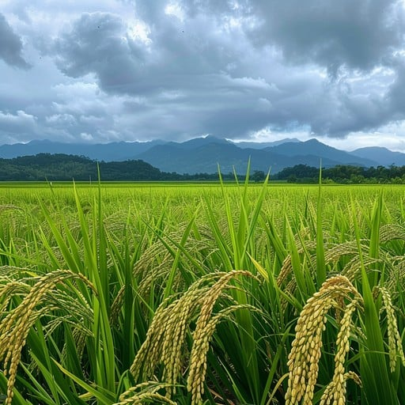

HEAD
# 🌾 GrainPalette: A Deep Learning Odyssey in Rice Type Classification



GrainPalette is a deep learning-powered web app that classifies rice grain images into 5 unique types using Transfer Learning and TensorFlow. Just upload a picture and get an instant prediction of the rice type. Clean UI. High accuracy. 

---

## Demo

➡️ Upload an image of rice grain  
✅ Model classifies it into one of the following types:

- Arborio
- Basmati
- Ipsala
- Jasmine
- Karacadag

---

##  Features

- 🔥 Transfer learning with MobileNetV2
- 📈 Achieves 97%+ accuracy on test data
- 🌐 Web app powered by Flask
- ⚡ Clean responsive UI (HTML5 + Bootstrap)
- 📷 Image upload and live prediction

---

## Tech Stack

| Layer             | Tech Used              |
|------------------|------------------------|
| Deep Learning    | TensorFlow, Keras      |
| Transfer Learning| MobileNetV2 (TF Hub)   |
| Web Framework    | Flask                  |
| Image Processing | OpenCV, NumPy          |
| Frontend         | HTML, CSS, Bootstrap   |

---

##  Run Locally

```bash
git clone https://github.com/sushma-boya/rice-type-classification.git
cd rice-type-classification

# Set up virtual environment
python -m venv .venv
# Activate it:
# On Windows
.venv\Scripts\activate
# On Mac/Linux
source .venv/bin/activate

# Install dependencies
pip install -r requirements.txt

# Run the app
python app.py

#Project Structure
Rice_type_detection/
├── app.py
├── rice_model.keras
├── requirements.txt
├── templates/
│   ├── index.html
│   ├── details.html
│   └── results.html
├── static/
│   ├── rice_banner.jpg
│   ├── arborio_sample.jpg
│   └── basmati_sacks.jpg
├── .gitignore
└── README.md

#Contact
📧 info@grainpalette.ai
📞 +91 98765 43210

Made by Sushma Naidu

# License
This project is licensed under the MIT License — see the LICENSE file for details.

# GrainPalette
 5d21522952b132dc0c6c008e79a4285362e528a0
